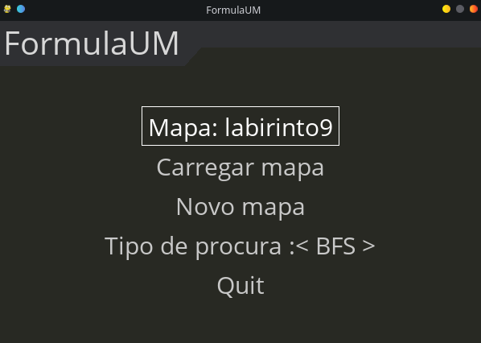
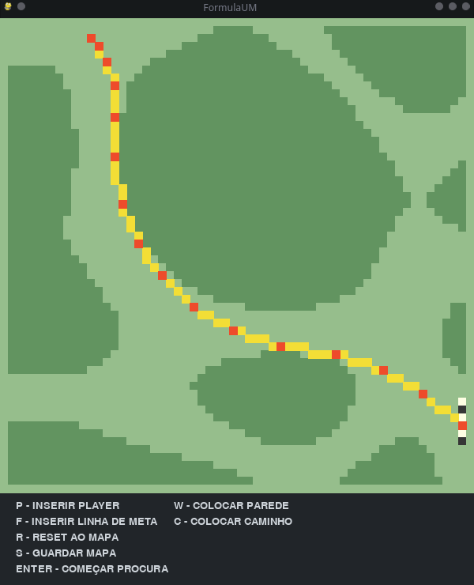
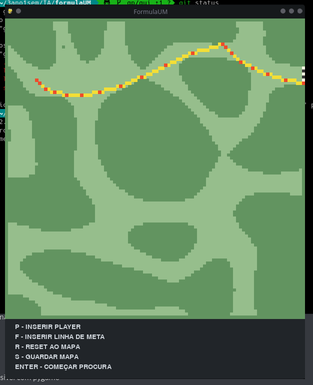

# Menu

When opening this project you will see this following menu, done using pygame-menu, very simple to use, where you can insert an especific labyrinth or generate one, and choose one algorithm to discover the solution between start point and finish line.
<p align="center">
  
</p>


# Algorithms

After choosing one of the algorithms available you will be jumping into this page, where you can manually insert your player, define your finishing line, put walls, open a path, reset map, save the map and obviously start the algorithm. This will return in a display of the algorithm, e.g. the yellow and red path you can see in the images below. This yellow and red pixeis define the path, red ones define the "jumps" the car will do due to its velocity and aceleration, yellow ones are just to fill the entire path, in a visual way.

<p align="center">
  
  
</p>

<p align="center">
  
</p>

# Requirements
```
noise==1.2.2
numpy==1.23.5
pygame==2.1.2
pygame-menu==4.3.1
pyperclip==1.8.2
typing_extensions==4.4.0
```

To install these packages run `pip install -r requirements.txt` in the root directory of this project.

# Running 

Use `python src/formulaum.py` inside a `.venv` environment.

## Develop Team
- [@CarlosHSF99](https://github.com/CarlosHSF99)
- [@cgustavop](https://github.com/cgustavop)
- [@assebc](https://github.com/assebc)
- [@VitorLelis](https://github.com/VitorLelis)